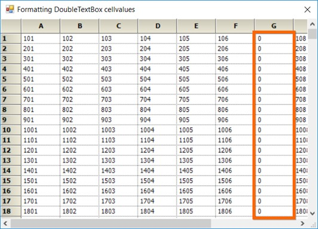

# How to Format the DoubleTextbox Cell in WinForms GridControl?

This example demonstrates how to format the doubletextbox cell in [WinForms GridControl](https://www.syncfusion.com/winforms-ui-controls/grid-control).

By default, the value "0" will be displayed as "0.00" in the [DoubleTextBox](https://help.syncfusion.com/windowsforms/grid-control/enhanced-cell-types#doubletextbox-cell-type) cell. To customize the display format of cell value, use the [DisplayText](https://help.syncfusion.com/cr/windowsforms/Syncfusion.Windows.Forms.Grid.GridDrawCellDisplayTextEventArgs.html#Syncfusion_Windows_Forms_Grid_GridDrawCellDisplayTextEventArgs_DisplayText) property in [DrawCellDisplayText](https://help.syncfusion.com/cr/windowsforms/Syncfusion.Windows.Forms.Grid.GridControlBase.html#Syncfusion_Windows_Forms_Grid_GridControlBase_DrawCellDisplayText) event.

``` c#
//Event Subscription
gridControl1.DrawCellDisplayText += GridControl1_DrawCellDisplayText;
 
//Event Customization
private void GridControl1_DrawCellDisplayText(object sender, GridDrawCellDisplayTextEventArgs e)
{
    if(e.Style.CellType== CustomCellTypes.DoubleTextBox.ToString() && e.DisplayText== "0.00")
    {
        e.DisplayText = "0";
    }
}
```

The screenshot below illustrates the format of grid cells.

